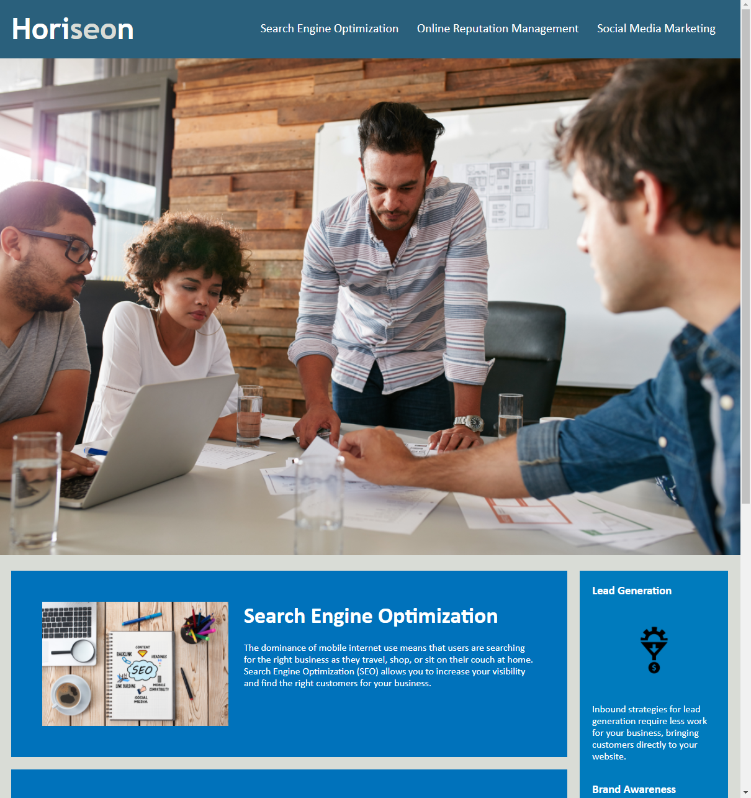

# 01 HTML, CSS, and Git: Code Refactor



## User Story

```
AS A marketing agency
I WANT a codebase that follows accessibility standards
SO THAT our own site is optimized for search engines
```

## Acceptance Criteria

```
GIVEN a webpage meets accessibility standards
WHEN I view the source code
THEN I find semantic HTML elements 
WHEN I view the structure of the HTML elements
THEN I find that the elements follow a logical structure independent of styling and positioning
WHEN I view the icon and image elements
THEN I find accessible alt attributes
WHEN I view the heading attributes
THEN they fall in sequential order
WHEN I view the title element
THEN I find a concise, descriptive title
```

## What's in this Repo
* Files provided in homework folder
* Updated CSS and html to use all semantic tags instead of non-sematic tags
* Checked and updated background colors that did not have enough contrast to be accessibility compliant
* Updated images tags to have alt tags


